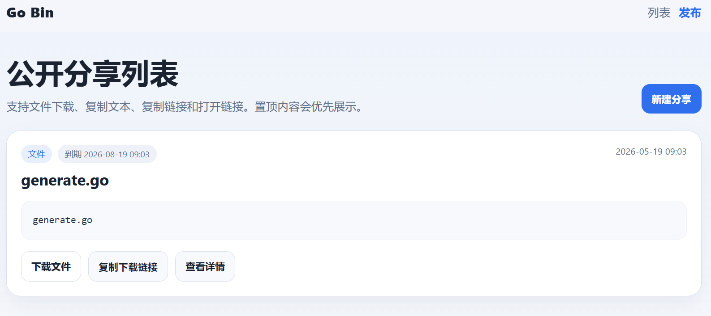
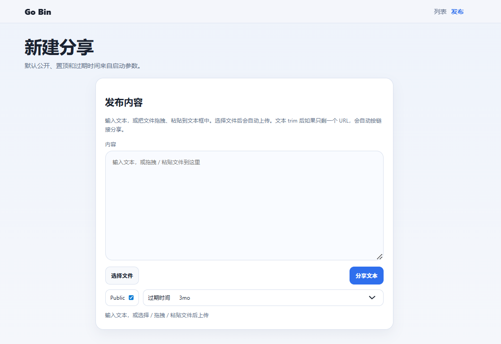
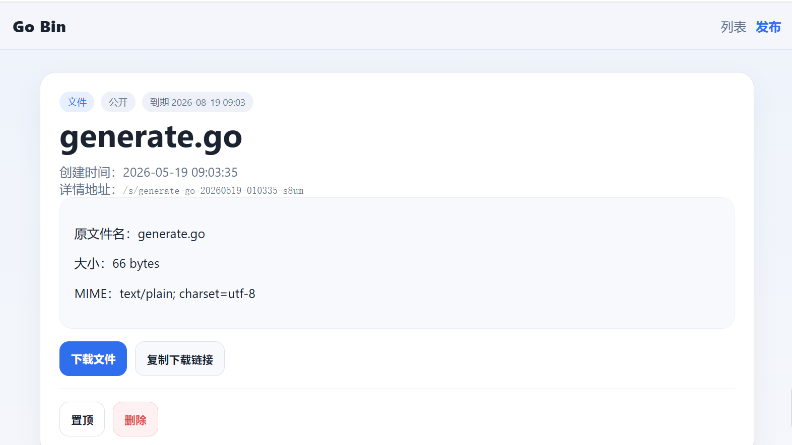

# go-bin

**English** | **[中文](README_EN.md)**

A lightweight file-sharing web service built with Go, supporting file, text, and link sharing.

## Installation

**Linux / macOS:**

```bash
curl -fsSL https://raw.githubusercontent.com/zaaack/go-bin/main/install.sh | bash
```

**Windows (PowerShell):**

```powershell
irm https://raw.githubusercontent.com/zaaack/go-bin/main/install.ps1 | iex
```

You can also download manually from the [Releases](https://github.com/zaaack/go-bin/releases) page.

## Features

- Public shares appear in the listing page
- Private shares use random URLs, accessible only via link
- Files preserve original filenames for display
- Text and links show a 2-line summary in the listing page
- Listing page supports file download, text copy, URL copy, and URL opening
- Detail page supports download, copy download link, copy text, copy URL, open URL
- Image and video inline preview
- Pinning support
- Expiration time and never-expire options
- SQLite for metadata, `uploads/` for file storage

## Getting Started

```powershell
$env:GO111MODULE = "on"
$env:GOPROXY = "https://goproxy.cn,direct"
go run ./cmd/go-bin serve
```

You can also generate an executable first:

```powershell
$env:GO111MODULE = "on"
$env:GOPROXY = "https://goproxy.cn,direct"
go generate .
```

## Parameters

```powershell
go run ./cmd/go-bin serve \
  --addr :8080 \
  --db data.db \
  --uploads-dir uploads \
  --base-url http://localhost:8080 \
  --default-public=true \
  --default-pin=false \
  --default-expire=3mo
```

`--db` supports specifying the SQLite file location.

`--default-expire` supports:

- `never`
- `1d`
- `7d`
- `30d`
- `1mo`
- `3mo`
- `1y`

## Pages

- `/` Public listing page
- `/new` Publish page
- `/s/{slug}` Detail page
- `/download/{slug}` File download

## Android App

An Android app wrapper is available in the `app/` directory, built with React + Capacitor.

```bash
cd app
pnpm install
pnpm android:build
```

## Screenshots

| Listing | Publish | Detail |
|---------|---------|--------|
|  |  |  |

## License

This project is licensed under the [MIT License](LICENSE).
